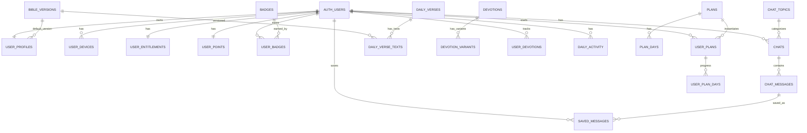

# Base de Datos - Biblia Chat

> **Estado:** Implementada en Supabase (dev)
> **Proyecto:** `biblia-chat-dev`
> **Última actualización:** Diciembre 2025

---

## Índice

- [A) Diagrama ERD](#a-diagrama-erd)
- [B) Tipos ENUM](#b-tipos-enum)
- [C) Tablas de Catálogo](#c-tablas-de-catálogo)
- [D) Tablas de Usuario](#d-tablas-de-usuario)
- [E) Tablas de Chat](#e-tablas-de-chat)
- [F) Tablas de Contenido](#f-tablas-de-contenido)
- [G) Tablas de Planes](#g-tablas-de-planes)
- [H) Datos Iniciales (Seed)](#h-datos-iniciales-seed)
- [I) Políticas RLS](#i-políticas-rls)
- [J) Índices](#j-índices)
- [K) Triggers de Auth](#k-triggers-de-auth)
- [L) Notas Funcionales](#l-notas-funcionales)

---

## A) Diagrama ERD



---

## B) Tipos ENUM

```sql
-- Denominación cristiana
CREATE TYPE denomination AS ENUM (
  'catolica',
  'evangelica',
  'pentecostal',
  'bautista',
  'metodista',
  'luterana',
  'adventista',
  'ortodoxa',
  'sin_denominacion',
  'otra'
);

-- Grupo de origen cultural
CREATE TYPE origin_group AS ENUM (
  'mexico_centroamerica',
  'caribe',
  'sudamerica',
  'espana',
  'usa_hispano'
);

-- Grupo de edad
CREATE TYPE age_group AS ENUM (
  '18-24',
  '25-34',
  '35-44',
  '45-54',
  '55+'
);

-- Género
CREATE TYPE gender_type AS ENUM (
  'male',
  'female'
);

-- Motivo principal de uso
CREATE TYPE motive_type AS ENUM (
  'estudio',
  'sufrimiento',
  'crecimiento',
  'comunidad',
  'habito',
  'otro'
);

-- Estado del plan de estudio
CREATE TYPE plan_status AS ENUM (
  'not_started',
  'in_progress',
  'completed',
  'abandoned'
);

-- Rol en el chat
CREATE TYPE chat_role AS ENUM (
  'user',
  'assistant',
  'system'
);

-- Plataforma del dispositivo
CREATE TYPE platform_type AS ENUM (
  'ios',
  'android'
);
```

---

## C) Tablas de Catálogo

### bible_versions
Versiones de la Biblia disponibles.

```sql
CREATE TABLE bible_versions (
  code TEXT PRIMARY KEY,              -- 'RVR1960', 'NVI', etc.
  name TEXT NOT NULL,                 -- 'Reina-Valera 1960'
  is_active BOOLEAN NOT NULL DEFAULT true,
  created_at TIMESTAMPTZ NOT NULL DEFAULT now()
);
```

### chat_topics
Temas de conversación para el chat IA.

```sql
CREATE TABLE chat_topics (
  key TEXT PRIMARY KEY,               -- 'familia_separada', 'desempleo', etc.
  title TEXT NOT NULL,                -- 'Oración por familia separada'
  description TEXT,
  sort_order INT NOT NULL DEFAULT 0,
  is_active BOOLEAN NOT NULL DEFAULT true,
  is_premium BOOLEAN NOT NULL DEFAULT false,
  created_at TIMESTAMPTZ NOT NULL DEFAULT now()
);
```

### badges
Insignias/logros disponibles.

```sql
CREATE TABLE badges (
  key TEXT PRIMARY KEY,               -- 'racha_7', 'primer_plan', etc.
  title TEXT NOT NULL,
  description TEXT NOT NULL,
  icon TEXT,                          -- emoji o nombre de icono
  points_required INT DEFAULT 0,
  is_active BOOLEAN NOT NULL DEFAULT true,
  sort_order INT NOT NULL DEFAULT 0,
  created_at TIMESTAMPTZ NOT NULL DEFAULT now()
);
```

---

## D) Tablas de Usuario

### user_profiles
Perfil del usuario (1:1 con auth.users). Se crea automáticamente via trigger.

```sql
CREATE TABLE user_profiles (
  user_id UUID PRIMARY KEY REFERENCES auth.users(id) ON DELETE CASCADE,
  name TEXT,
  denomination denomination,
  origin origin_group,
  age_group age_group,
  motive motive_type,
  reminder_enabled BOOLEAN NOT NULL DEFAULT false,
  reminder_time TIME,
  persistence_self_report BOOLEAN,
  first_message TEXT,                 -- "¿Qué hay en tu corazón?"
  bible_version_code TEXT REFERENCES bible_versions(code) DEFAULT 'RVR1960',
  ai_memory JSONB,                    -- Memoria global para personalización IA
  timezone TEXT DEFAULT 'America/New_York',
  onboarding_completed BOOLEAN NOT NULL DEFAULT false,
  theme TEXT DEFAULT 'auto',          -- 'light', 'dark', 'auto'
  created_at TIMESTAMPTZ NOT NULL DEFAULT now(),
  updated_at TIMESTAMPTZ NOT NULL DEFAULT now(),
  rc_app_user_id TEXT UNIQUE,         -- RevenueCat ID para restaurar compras + datos
  gender gender_type                  -- 'male', 'female'
);
```

**Campo especial `rc_app_user_id`:**
- Se guarda al realizar la primera compra (vinculado al Apple ID / Google Account)
- Permite restaurar compras Y migrar todos los datos del usuario si reinstala la app
- Es UNIQUE para evitar duplicados y permitir búsqueda rápida

**Campo especial `ai_memory`:**
```json
{
  "nombre_preferido": "María",
  "hijos": ["Juanito (8)", "Ana (5)"],
  "situacion_familiar": "Esposo en México, ella en Houston",
  "trabajo": "Limpieza de casas",
  "parroquia": "San José",
  "preocupaciones_recurrentes": ["documentos", "hijos"]
}
```

### user_devices
Dispositivos para push notifications (FCM).

```sql
CREATE TABLE user_devices (
  id UUID PRIMARY KEY DEFAULT gen_random_uuid(),
  user_id UUID NOT NULL REFERENCES auth.users(id) ON DELETE CASCADE,
  platform platform_type NOT NULL,
  device_token TEXT NOT NULL UNIQUE,
  last_seen_at TIMESTAMPTZ NOT NULL DEFAULT now(),
  created_at TIMESTAMPTZ NOT NULL DEFAULT now(),
  updated_at TIMESTAMPTZ NOT NULL DEFAULT now()
);
```

### user_entitlements
Estado de suscripción/premium. Se crea automáticamente via trigger.

```sql
CREATE TABLE user_entitlements (
  user_id UUID PRIMARY KEY REFERENCES auth.users(id) ON DELETE CASCADE,
  is_premium BOOLEAN NOT NULL DEFAULT false,
  trial_active BOOLEAN NOT NULL DEFAULT false,
  trial_started_at TIMESTAMPTZ,
  expires_at TIMESTAMPTZ,
  last_synced_at TIMESTAMPTZ NOT NULL DEFAULT now(),
  source TEXT,                        -- 'revenuecat', 'manual', etc.
  created_at TIMESTAMPTZ NOT NULL DEFAULT now(),
  updated_at TIMESTAMPTZ NOT NULL DEFAULT now()
);
```

### user_points
Puntos acumulados. Se crea automáticamente via trigger.

```sql
CREATE TABLE user_points (
  user_id UUID PRIMARY KEY REFERENCES auth.users(id) ON DELETE CASCADE,
  total_points INT NOT NULL DEFAULT 0,
  updated_at TIMESTAMPTZ NOT NULL DEFAULT now()
);
```

### user_badges
Badges ganados por el usuario.

```sql
CREATE TABLE user_badges (
  id UUID PRIMARY KEY DEFAULT gen_random_uuid(),
  user_id UUID NOT NULL REFERENCES auth.users(id) ON DELETE CASCADE,
  badge_key TEXT NOT NULL REFERENCES badges(key),
  earned_at TIMESTAMPTZ NOT NULL DEFAULT now(),
  UNIQUE(user_id, badge_key)          -- Un badge solo se gana una vez
);
```

---

## E) Tablas de Chat

### chats
Conversaciones/hilos de chat.

```sql
CREATE TABLE chats (
  id UUID PRIMARY KEY DEFAULT gen_random_uuid(),
  user_id UUID NOT NULL REFERENCES auth.users(id) ON DELETE CASCADE,
  topic_key TEXT REFERENCES chat_topics(key),
  title TEXT,                         -- Título personalizado opcional
  openai_conversation_id TEXT,        -- Reservado (NULL en MVP)
  context_summary TEXT,               -- Resumen del contexto para optimizar IA
  last_message_at TIMESTAMPTZ,
  last_message_preview TEXT,          -- Preview para lista de chats
  created_at TIMESTAMPTZ NOT NULL DEFAULT now(),
  updated_at TIMESTAMPTZ NOT NULL DEFAULT now(),
  UNIQUE(user_id, topic_key)          -- MVP: un chat por tema por usuario
);
```

### chat_messages
Mensajes dentro de cada chat.

```sql
CREATE TABLE chat_messages (
  id UUID PRIMARY KEY DEFAULT gen_random_uuid(),
  chat_id UUID NOT NULL REFERENCES chats(id) ON DELETE CASCADE,
  role chat_role NOT NULL,            -- 'user', 'assistant', 'system'
  content TEXT NOT NULL,
  created_at TIMESTAMPTZ NOT NULL DEFAULT now()
);
```

### saved_messages
Mensajes guardados/favoritos.

```sql
CREATE TABLE saved_messages (
  id UUID PRIMARY KEY DEFAULT gen_random_uuid(),
  user_id UUID NOT NULL REFERENCES auth.users(id) ON DELETE CASCADE,
  chat_message_id UUID NOT NULL REFERENCES chat_messages(id) ON DELETE CASCADE,
  saved_at TIMESTAMPTZ NOT NULL DEFAULT now(),
  UNIQUE(user_id, chat_message_id)    -- No duplicar
);
```

---

## F) Tablas de Contenido

### daily_verses
Versículos del día (referencia).

```sql
CREATE TABLE daily_verses (
  verse_date DATE PRIMARY KEY,
  reference TEXT NOT NULL,            -- "Proverbios 3:5-6"
  context_notes TEXT,                 -- Notas de contexto histórico
  created_at TIMESTAMPTZ NOT NULL DEFAULT now()
);
```

### daily_verse_texts
Texto del versículo por versión de Biblia, con contenido para Stories generado por IA.

```sql
CREATE TABLE daily_verse_texts (
  verse_date DATE NOT NULL REFERENCES daily_verses(verse_date) ON DELETE CASCADE,
  bible_version_code TEXT NOT NULL REFERENCES bible_versions(code),
  verse_text TEXT NOT NULL,
  created_at TIMESTAMPTZ NOT NULL DEFAULT now(),
  verse_summary TEXT,                 -- Resumen coloquial (300-500 chars)
  key_concept TEXT,                   -- Concepto/frase clave (max 60 chars)
  practical_exercise TEXT,            -- Ejercicio práctico del día (80-150 chars)
  PRIMARY KEY (verse_date, bible_version_code)
);
```

**Campos generados por IA (Stories):**

Estos 3 campos son generados automáticamente por la Edge Function `fetch-daily-gospel` usando **OpenAI GPT-5.2**:

| Campo | Descripción | Longitud |
|-------|-------------|----------|
| `verse_summary` | Resumen storytelling del pasaje en lenguaje coloquial | 300-500 chars |
| `key_concept` | Frase potente estilo copywriting que resume el mensaje | Max 60 chars |
| `practical_exercise` | Acción física y concreta para hacer HOY | 80-150 chars |

**Ejemplos:**
- **verse_summary:** "Jesús les advirtió a sus discípulos que no sería fácil seguirle. Les dijo que iban a enfrentar persecución, incluso de su propia familia. Pero también les prometió algo increíble: que en esos momentos difíciles, el Espíritu Santo les daría exactamente las palabras que necesitaban."
- **key_concept:** "El miedo miente, la fe actúa"
- **practical_exercise:** "Envía un audio de WhatsApp a alguien diciéndole por qué lo aprecias"

### devotions
Devociones del día.

```sql
CREATE TABLE devotions (
  devotion_date DATE PRIMARY KEY,
  title TEXT NOT NULL,
  central_verse_reference TEXT,
  reading_minutes INT DEFAULT 3,
  created_at TIMESTAMPTZ NOT NULL DEFAULT now()
);
```

### devotion_variants
Variantes de devoción por denominación/contexto.

```sql
CREATE TABLE devotion_variants (
  devotion_date DATE NOT NULL REFERENCES devotions(devotion_date) ON DELETE CASCADE,
  variant_key TEXT NOT NULL,          -- 'general', 'catolica', 'evangelica'
  content TEXT NOT NULL,
  created_at TIMESTAMPTZ NOT NULL DEFAULT now(),
  PRIMARY KEY (devotion_date, variant_key)
);
```

### user_devotions
Tracking de devociones vistas.

```sql
CREATE TABLE user_devotions (
  id UUID PRIMARY KEY DEFAULT gen_random_uuid(),
  user_id UUID NOT NULL REFERENCES auth.users(id) ON DELETE CASCADE,
  devotion_date DATE NOT NULL REFERENCES devotions(devotion_date),
  viewed_at TIMESTAMPTZ NOT NULL DEFAULT now(),
  saved BOOLEAN NOT NULL DEFAULT false,
  UNIQUE(user_id, devotion_date)
);
```

### daily_activity
Actividad diaria para racha/streak.

```sql
CREATE TABLE daily_activity (
  user_id UUID NOT NULL REFERENCES auth.users(id) ON DELETE CASCADE,
  activity_date DATE NOT NULL,
  completed BOOLEAN NOT NULL DEFAULT true,
  source TEXT,                        -- 'devotion', 'chat', 'plan'
  created_at TIMESTAMPTZ NOT NULL DEFAULT now(),
  PRIMARY KEY (user_id, activity_date)
);
```

---

## G) Tablas de Planes

### plans
Planes de estudio (catálogo).

```sql
CREATE TABLE plans (
  id UUID PRIMARY KEY DEFAULT gen_random_uuid(),
  name TEXT NOT NULL,
  description TEXT NOT NULL,
  short_description TEXT,             -- Para cards
  days_total INT NOT NULL CHECK (days_total > 0),
  icon TEXT,                          -- emoji
  target_audience TEXT,               -- "Para migrantes, padres separados"
  is_premium BOOLEAN NOT NULL DEFAULT false,
  is_active BOOLEAN NOT NULL DEFAULT true,
  sort_order INT NOT NULL DEFAULT 0,
  created_at TIMESTAMPTZ NOT NULL DEFAULT now()
);
```

### plan_days
Días de cada plan (contenido).

```sql
CREATE TABLE plan_days (
  id UUID PRIMARY KEY DEFAULT gen_random_uuid(),
  plan_id UUID NOT NULL REFERENCES plans(id) ON DELETE CASCADE,
  day_number INT NOT NULL CHECK (day_number > 0),
  verse_references TEXT[] NOT NULL,   -- Array de referencias bíblicas
  reflection TEXT NOT NULL,           -- Reflexión del día (150-200 palabras)
  question TEXT NOT NULL,             -- Pregunta abierta
  created_at TIMESTAMPTZ NOT NULL DEFAULT now(),
  UNIQUE(plan_id, day_number)
);
```

### user_plans
Instancias de plan por usuario (progreso).

```sql
CREATE TABLE user_plans (
  id UUID PRIMARY KEY DEFAULT gen_random_uuid(),
  user_id UUID NOT NULL REFERENCES auth.users(id) ON DELETE CASCADE,
  plan_id UUID NOT NULL REFERENCES plans(id),
  status plan_status NOT NULL DEFAULT 'in_progress',
  current_day INT NOT NULL DEFAULT 1,
  started_at TIMESTAMPTZ NOT NULL DEFAULT now(),
  completed_at TIMESTAMPTZ,
  created_at TIMESTAMPTZ NOT NULL DEFAULT now(),
  updated_at TIMESTAMPTZ NOT NULL DEFAULT now(),
  UNIQUE(user_id, plan_id)
);
```

### user_plan_days
Progreso diario del plan.

```sql
CREATE TABLE user_plan_days (
  id UUID PRIMARY KEY DEFAULT gen_random_uuid(),
  user_plan_id UUID NOT NULL REFERENCES user_plans(id) ON DELETE CASCADE,
  day_number INT NOT NULL,
  user_answer TEXT,                   -- Respuesta a la pregunta
  completed_via TEXT,                 -- 'answer', 'chat', 'skip'
  completed_at TIMESTAMPTZ NOT NULL DEFAULT now(),
  UNIQUE(user_plan_id, day_number)
);
```

---

## H) Datos Iniciales (Seed)

### Versiones de Biblia

| code | name |
|------|------|
| RVR1960 | Reina-Valera 1960 |
| NVI | Nueva Versión Internacional |
| LBLA | La Biblia de las Américas |
| NTV | Nueva Traducción Viviente |
| DHH | Dios Habla Hoy |

### Temas de Chat (10)

| key | title | description |
|-----|-------|-------------|
| familia_separada | Oración por familia separada | Para quienes tienen familiares lejos |
| desempleo | Fe en desempleo | Cuando el trabajo escasea |
| solteria | Soltería cristiana | Vivir la soltería con propósito |
| ansiedad_miedo | Ansiedad y miedo | Encontrar paz en tiempos difíciles |
| identidad_bicultural | Identidad bicultural | Entre dos mundos y culturas |
| reconciliacion | Reconciliación familiar | Sanar relaciones rotas |
| sacramentos | Bautismo / Confirmación | Preguntas sobre sacramentos |
| oracion | Oración personalizada | Orar juntos sobre tu situación |
| preguntas_biblia | Preguntas sobre la Biblia | Dudas y estudios bíblicos |
| otro | Otro tema | Cualquier otra cosa en tu corazón |

### Badges (6)

| key | title | icon |
|-----|-------|------|
| primer_plan | Primer Plan Completado | 🏅 |
| cinco_planes | 5 Planes Completados | 🏆 |
| racha_7 | Semana de Fe | 🔥 |
| racha_30 | Mes de Fe | 🔥 |
| racha_100 | Centenario | 💯 |
| expert_studier | Estudiante Experto | 👨‍🎓 |

### Planes de Estudio (7 MVP)

| # | name | days | icon | target_audience |
|---|------|------|------|-----------------|
| 1 | Fe Cuando Familia Está Lejos | 7 | 🏠 | Migrantes, padres separados |
| 2 | Trabajo y Provisión Divina | 5 | 💼 | Desempleados |
| 3 | Soltería Enraizada en Cristo | 7 | 💝 | Jóvenes solteros, divorciados |
| 4 | Resiste la Ansiedad con Fe | 5 | 🕊️ | Quienes sufren ansiedad |
| 5 | Gratitud en Medio del Caos | 5 | 🙏 | Quienes luchan con amargura |
| 6 | Discípulo en Dos Idiomas | 7 | 🌎 | Segunda/tercera generación |
| 7 | Sanidad del Corazón Inmigrante | 7 | ❤️‍🩹 | Quienes cargan trauma migratorio |

---

## I) Políticas RLS

### Función Helper

```sql
CREATE OR REPLACE FUNCTION public.is_owner(p_user_id uuid)
RETURNS boolean
LANGUAGE sql STABLE
AS $$ SELECT auth.uid() = p_user_id; $$;
```

### Tablas con RLS por Usuario

Todas estas tablas tienen políticas CRUD para el dueño:

| Tabla | Política |
|-------|----------|
| user_profiles | Solo el dueño puede CRUD |
| user_devices | Solo el dueño puede CRUD |
| user_entitlements | Solo el dueño puede CRUD |
| chats | Solo el dueño puede CRUD |
| chat_messages | Via JOIN a chats (ownership indirecto) |
| saved_messages | Solo el dueño + validación de ownership del mensaje |
| user_devotions | Solo el dueño puede CRUD |
| daily_activity | Solo el dueño puede CRUD |
| user_points | Solo el dueño puede CRUD |
| user_badges | Solo el dueño puede CRUD |
| user_plans | Solo el dueño puede CRUD |
| user_plan_days | Via JOIN a user_plans (ownership indirecto) |

### Tablas de Catálogo (Lectura Pública)

```sql
-- Estas tablas son de solo lectura para todos los usuarios autenticados
-- Escritura solo via service_role (admin)

ALTER TABLE bible_versions ENABLE ROW LEVEL SECURITY;
CREATE POLICY "bible_versions_read_all" ON bible_versions FOR SELECT USING (true);
REVOKE INSERT, UPDATE, DELETE ON bible_versions FROM authenticated;

ALTER TABLE chat_topics ENABLE ROW LEVEL SECURITY;
CREATE POLICY "chat_topics_read_all" ON chat_topics FOR SELECT USING (true);
REVOKE INSERT, UPDATE, DELETE ON chat_topics FROM authenticated;

ALTER TABLE badges ENABLE ROW LEVEL SECURITY;
CREATE POLICY "badges_read_all" ON badges FOR SELECT USING (true);
REVOKE INSERT, UPDATE, DELETE ON badges FROM authenticated;

ALTER TABLE daily_verses ENABLE ROW LEVEL SECURITY;
CREATE POLICY "daily_verses_read_all" ON daily_verses FOR SELECT USING (true);

ALTER TABLE daily_verse_texts ENABLE ROW LEVEL SECURITY;
CREATE POLICY "daily_verse_texts_read_all" ON daily_verse_texts FOR SELECT USING (true);

ALTER TABLE devotions ENABLE ROW LEVEL SECURITY;
CREATE POLICY "devotions_read_all" ON devotions FOR SELECT USING (true);

ALTER TABLE devotion_variants ENABLE ROW LEVEL SECURITY;
CREATE POLICY "devotion_variants_read_all" ON devotion_variants FOR SELECT USING (true);

ALTER TABLE plans ENABLE ROW LEVEL SECURITY;
CREATE POLICY "plans_read_all" ON plans FOR SELECT USING (true);

ALTER TABLE plan_days ENABLE ROW LEVEL SECURITY;
CREATE POLICY "plan_days_read_all" ON plan_days FOR SELECT USING (true);
```

### Protección Especial

```sql
-- Los mensajes de chat NO se pueden editar (solo crear/leer/borrar)
REVOKE UPDATE ON TABLE chat_messages FROM authenticated;
```

---

## J) Índices

### Performance Crítica

```sql
-- Chats del usuario ordenados
CREATE INDEX idx_chats_user_last_message ON chats(user_id, last_message_at DESC NULLS LAST);
CREATE INDEX idx_chats_user_topic_key ON chats(user_id, topic_key);

-- Mensajes por chat (paginación)
CREATE INDEX idx_chat_messages_chat_created ON chat_messages(chat_id, created_at DESC);

-- Racha/actividad diaria
CREATE INDEX idx_daily_activity_user_date ON daily_activity(user_id, activity_date DESC);
CREATE INDEX idx_daily_activity_user_completed_date ON daily_activity(user_id, completed, activity_date DESC);

-- Planes del usuario
CREATE INDEX idx_user_plans_user_status_updated ON user_plans(user_id, status, updated_at DESC);
CREATE INDEX idx_user_plan_days_user_plan_day ON user_plan_days(user_plan_id, day_number);

-- Contenido diario
CREATE INDEX idx_daily_verse_texts_date_version ON daily_verse_texts(verse_date, bible_version_code);
CREATE INDEX idx_devotion_variants_date_variant ON devotion_variants(devotion_date, variant_key);

-- FCM/Dispositivos
CREATE INDEX idx_user_devices_user_last_seen ON user_devices(user_id, last_seen_at DESC);
CREATE INDEX idx_user_devices_token ON user_devices(device_token);

-- RevenueCat (restauración de compras)
CREATE INDEX idx_user_profiles_rc_app_user_id ON user_profiles(rc_app_user_id) WHERE rc_app_user_id IS NOT NULL;

-- Catálogos
CREATE INDEX idx_chat_topics_active_sort ON chat_topics(is_active, sort_order);
CREATE INDEX idx_badges_active_sort ON badges(is_active, sort_order);
CREATE INDEX idx_plans_active_premium ON plans(is_active, is_premium);
```

---

## K) Triggers de Auth

### Auto-crear perfil al registrarse

```sql
CREATE OR REPLACE FUNCTION public.handle_new_user()
RETURNS TRIGGER AS $$
BEGIN
  -- Crear perfil de usuario
  INSERT INTO public.user_profiles (user_id)
  VALUES (NEW.id)
  ON CONFLICT (user_id) DO NOTHING;

  -- Crear registro de puntos
  INSERT INTO public.user_points (user_id, total_points)
  VALUES (NEW.id, 0)
  ON CONFLICT (user_id) DO NOTHING;

  -- Crear registro de entitlements (free por defecto)
  INSERT INTO public.user_entitlements (user_id, is_premium, trial_active)
  VALUES (NEW.id, false, false)
  ON CONFLICT (user_id) DO NOTHING;

  RETURN NEW;
END;
$$ LANGUAGE plpgsql SECURITY DEFINER;

CREATE TRIGGER on_auth_user_created
  AFTER INSERT ON auth.users
  FOR EACH ROW
  EXECUTE FUNCTION public.handle_new_user();
```

### Auto-actualizar updated_at

```sql
CREATE OR REPLACE FUNCTION update_updated_at_column()
RETURNS TRIGGER AS $$
BEGIN
  NEW.updated_at = now();
  RETURN NEW;
END;
$$ language 'plpgsql';

-- Aplicado a: user_profiles, user_devices, user_entitlements,
--             user_points, chats, user_plans
```

---

## L) Notas Funcionales

### Timezone y Fecha Local

- `user_profiles.timezone` es **IANA timezone** (ej. `"America/New_York"`)
- Todas las métricas diarias (racha, daily_activity, badges) se calculan con **fecha local del usuario**
- El backend debe convertir timestamps a fecha local antes de evaluar lógica diaria

### Constraint Importante: Un Chat por Tema

```sql
UNIQUE(user_id, topic_key)  -- en tabla chats
```

En el MVP, cada usuario tiene máximo un chat por cada tema. Esto simplifica la lógica y UX.

### Campo openai_conversation_id

Existe en `chats` pero **no se usa en MVP**. Reservado para futura integración con threads de OpenAI.

### Orden del Prompt IA

1. Prompt base (system)
2. Instrucciones dinámicas (denominación, etc.)
3. ai_memory (del user_profile)
4. context_summary (del chat)
5. Últimos 12 mensajes del historial

### Escalabilidad: Particionamiento

Para `chat_messages` cuando supere ~100M filas, considerar particionar por `created_at`:

```sql
-- Ejemplo futuro (no implementado en MVP)
CREATE TABLE chat_messages (
  ...
) PARTITION BY RANGE (created_at);
```

---

## Archivos de Migración

Las migraciones se encuentran en `/supabase/migrations/`:

| Archivo | Descripción |
|---------|-------------|
| 00001_create_enums.sql | Tipos ENUM |
| 00002_create_catalog_tables.sql | Tablas catálogo + seed data |
| 00003_create_user_tables.sql | Tablas de usuario |
| 00004_create_chat_tables.sql | Tablas de chat |
| 00005_create_content_tables.sql | Tablas de contenido |
| 00006_create_plan_tables.sql | Tablas de planes + seed data |
| 00007_create_rls_policies.sql | Políticas RLS |
| 00008_create_indexes.sql | Índices |
| 00009_create_auth_triggers.sql | Triggers de auth |
| 00010_add_revenuecat_id.sql | Campo rc_app_user_id para restaurar compras |
| 00011_add_gender_column.sql | Campo gender + enum gender_type |
| 00012_add_verse_summary.sql | Campo verse_summary para resumen coloquial IA |
| 00013_add_gospel_story_columns.sql | Campos key_concept y practical_exercise para Stories |

---

## M) Edge Functions

### fetch-daily-gospel (desplegada como `clever-worker`)

Edge Function que se ejecuta diariamente para obtener el Evangelio del día y generar contenido para Stories.

**Ubicación:**
- Código fuente: `supabase/functions/fetch-daily-gospel/index.ts`
- Nombre en Supabase: `clever-worker`

**Ejecución automática:**
- **GitHub Actions** cron diario: `.github/workflows/daily-gospel.yml`
- Horario: `0 6 * * *` (6:00 AM UTC = 7:00 AM España)
- Secret requerido en GitHub: `SUPABASE_SERVICE_ROLE_KEY`

**Flujo:**
1. Consulta **Catholic Readings API** → referencia del día (ej: "Matthew 2:13-15, 19-23")
2. Consulta **API.Bible** → texto en español (Reina Valera 1909 → guardado como RVR1960)
   - Soporta **versículos no contiguos**: hace múltiples llamadas y concatena
   - Ej: "13-15, 19-23" → 2 llamadas a API.Bible → texto completo
3. Genera contenido para Stories con **OpenAI GPT-5.2**:
   - `verse_summary`: Resumen storytelling (300-500 chars)
   - `key_concept`: Frase potente estilo copywriting (max 60 chars)
   - `practical_exercise`: Acción física y concreta para el día (80-150 chars)
4. Guarda en `daily_verses` + `daily_verse_texts`

**APIs utilizadas:**
| API | Propósito | Auth |
|-----|-----------|------|
| Catholic Readings API | Calendario litúrgico (qué leer) | Pública (sin key) |
| API.Bible | Texto bíblico en español | API Key |
| OpenAI GPT-5.2 | Generar contenido para Stories | API Key |

**Configuración OpenAI:**
```typescript
{
  model: "gpt-5.2",
  messages: [
    { role: "developer", content: systemPrompt },  // GPT-5.2 usa "developer" en vez de "system"
    { role: "user", content: userPrompt }
  ],
  max_completion_tokens: 600,  // GPT-5.2 usa este parámetro en vez de max_tokens
  temperature: 0.9
}
```

**Prompt optimizado:**
- Español de España (no latinoamérica)
- Segunda persona del singular (tú, te, ti)
- Sin jerga forzada ("imagínate", "salir pitando", etc.)
- Presente histórico para el resumen

**Secrets requeridos en Supabase:**
- `API_BIBLE_KEY` - Clave de API.Bible
- `OPENAI_API_KEY` - Clave de OpenAI

**Ejecución:**
- **Automática:** GitHub Actions cron (6:00 AM UTC diario)
- **Manual GitHub:** Actions → Fetch Daily Gospel → Run workflow
- **Manual Supabase:** Dashboard → Edge Functions → clever-worker → Test

**Notas importantes:**
- GPT-5.2 usa `role: "developer"` en lugar de `role: "system"`
- GPT-5.2 usa `max_completion_tokens` en lugar de `max_tokens`
- El ejercicio práctico NUNCA debe ser orar/rezar/meditar - debe ser algo físico y tangible
- Versículos no contiguos (ej: "13-15, 19-23") se manejan con múltiples llamadas a API.Bible
