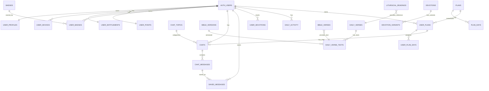

# Base de Datos - Biblia Chat

> **Estado:** Implementada en Supabase (dev)
> **Proyecto:** `biblia-chat-dev`
> **Última actualización:** 13 Febrero 2026

---

## Índice

- [A) Diagrama ERD](#a-diagrama-erd)
- [B) Tipos ENUM](#b-tipos-enum)
- [C) Tablas de Catálogo](#c-tablas-de-catálogo)
- [D) Tablas de Usuario](#d-tablas-de-usuario)
- [E) Tablas de Chat](#e-tablas-de-chat)
- [F) Tablas de Contenido](#f-tablas-de-contenido)
- [G) Tablas de Planes](#g-tablas-de-planes)
- [H) Datos Iniciales (Seed)](#h-datos-iniciales-seed)
- [I) Políticas RLS](#i-políticas-rls)
- [J) Índices](#j-índices)
- [K) Triggers de Auth](#k-triggers-de-auth)
- [L) Notas Funcionales](#l-notas-funcionales)
- [M) Edge Functions](#m-edge-functions)
- [N) Integración Flutter con daily_activity](#n-integración-flutter-con-daily_activity)
  - [Patrón Optimistic UI](#patrón-optimistic-ui)
  - [Aislamiento de Datos por Usuario](#aislamiento-de-datos-por-usuario)
- [O) Sistema de Límite de Mensajes](#o-sistema-de-límite-de-mensajes)
- [P) Mantenimiento Periódico](#p-mantenimiento-periódico)

---

## A) Diagrama ERD



---

## B) Tipos ENUM

```sql
-- Denominación cristiana
CREATE TYPE denomination AS ENUM (
  'catolica',
  'evangelica',
  'pentecostal',
  'bautista',
  'metodista',
  'luterana',
  'adventista',
  'ortodoxa',
  'sin_denominacion',
  'otra'
);

-- Grupo de origen cultural
CREATE TYPE origin_group AS ENUM (
  'mexico_centroamerica',
  'caribe',
  'sudamerica',
  'espana',
  'usa_hispano'
);

-- Grupo de edad
CREATE TYPE age_group AS ENUM (
  '18-24',
  '25-34',
  '35-44',
  '45-54',
  '55+'
);

-- Género
CREATE TYPE gender_type AS ENUM (
  'male',
  'female'
);

-- Estado del plan de estudio
CREATE TYPE plan_status AS ENUM (
  'not_started',
  'in_progress',
  'completed',
  'abandoned'
);

-- Rol en el chat
CREATE TYPE chat_role AS ENUM (
  'user',
  'assistant',
  'system'
);

-- Plataforma del dispositivo
CREATE TYPE platform_type AS ENUM (
  'ios',
  'android'
);
```

---

## C) Tablas de Catálogo

### bible_versions
Versiones de la Biblia disponibles.

```sql
CREATE TABLE bible_versions (
  code TEXT PRIMARY KEY,              -- 'RVR1960', 'NVI', etc.
  name TEXT NOT NULL,                 -- 'Reina-Valera 1960'
  is_active BOOLEAN NOT NULL DEFAULT true,
  created_at TIMESTAMPTZ NOT NULL DEFAULT now()
);
```

### chat_topics
Temas de conversación para el chat IA.

```sql
CREATE TABLE chat_topics (
  key TEXT PRIMARY KEY,               -- 'familia_separada', 'desempleo', etc.
  title TEXT NOT NULL,                -- 'Oración por familia separada'
  description TEXT,
  sort_order INT NOT NULL DEFAULT 0,
  is_active BOOLEAN NOT NULL DEFAULT true,
  is_premium BOOLEAN NOT NULL DEFAULT false,
  created_at TIMESTAMPTZ NOT NULL DEFAULT now()
);
```

### badges
Insignias/logros disponibles.

```sql
CREATE TABLE badges (
  key TEXT PRIMARY KEY,               -- 'racha_7', 'primer_plan', etc.
  title TEXT NOT NULL,
  description TEXT NOT NULL,
  icon TEXT,                          -- emoji o nombre de icono
  points_required INT DEFAULT 0,
  is_active BOOLEAN NOT NULL DEFAULT true,
  sort_order INT NOT NULL DEFAULT 0,
  created_at TIMESTAMPTZ NOT NULL DEFAULT now()
);
```

### bible_verses
Biblia Reina Valera 1909 completa almacenada localmente. Reemplaza la dependencia de API.Bible.

```sql
CREATE TABLE bible_verses (
  id SERIAL PRIMARY KEY,
  book_id VARCHAR(3) NOT NULL,        -- GEN, EXO, MRK, LUK, JHN, etc.
  book_name VARCHAR(50) NOT NULL,     -- Génesis, Éxodo, Marcos, Lucas, Juan
  chapter INT NOT NULL,
  verse INT NOT NULL,
  text TEXT NOT NULL,
  UNIQUE(book_id, chapter, verse)
);

-- Índices para búsquedas rápidas
CREATE INDEX idx_bible_verses_lookup ON bible_verses(book_id, chapter, verse);
CREATE INDEX idx_bible_verses_range ON bible_verses(book_id, chapter);
```

**Estadísticas:**
- **20,353 versículos** de la Reina Valera 1909 (dominio público)
- **66 libros** (Antiguo y Nuevo Testamento completos)

**Uso:**
- La Edge Function `fetch-daily-gospel` consulta esta tabla en lugar de API.Bible
- Soporta búsquedas por libro, capítulo y rango de versículos
- Maneja versículos no contiguos (ej: "13-15, 19-23") con múltiples queries

**Book IDs (formato API.Bible):**
| Antiguo Testamento | Nuevo Testamento |
|-------------------|------------------|
| GEN, EXO, LEV, NUM, DEU | MAT, MRK, LUK, JHN |
| JOS, JDG, RUT, 1SA, 2SA | ACT, ROM, 1CO, 2CO |
| 1KI, 2KI, 1CH, 2CH | GAL, EPH, PHP, COL |
| EZR, NEH, EST, JOB | 1TH, 2TH, 1TI, 2TI |
| PSA, PRO, ECC, SNG | TIT, PHM, HEB, JAS |
| ISA, JER, LAM, EZK, DAN | 1PE, 2PE, 1JN, 2JN, 3JN |
| HOS, JOL, AMO, OBA, JON | JUD, REV |
| MIC, NAM, HAB, ZEP, HAG, ZEC, MAL | |

### liturgical_readings
Calendario litúrgico católico almacenado localmente. Reemplaza la dependencia de la API externa (cpbjr.github.io).

```sql
CREATE TABLE liturgical_readings (
  id SERIAL PRIMARY KEY,
  reading_date DATE NOT NULL UNIQUE,
  season TEXT,                          -- "Ordinary Time", "Lent", "Advent", etc.
  first_reading TEXT,                   -- "1 Samuel 4:1-11"
  psalm TEXT,                           -- "Psalm 89"
  second_reading TEXT,                  -- NULL si no hay (días entre semana)
  gospel TEXT NOT NULL,                 -- "Mark 1:40-45"
  created_at TIMESTAMPTZ DEFAULT now()
);

CREATE INDEX idx_liturgical_readings_date ON liturgical_readings(reading_date);
```

**Estadísticas actuales:**
- **2026: 365 lecturas** (año completo: 1 enero - 31 diciembre)
- Incluye: temporada litúrgica, primera lectura, salmo, segunda lectura (domingos), evangelio

**Uso:**
- La Edge Function `fetch-daily-gospel` consulta esta tabla PRIMERO
- Si no hay datos para la fecha, hace fallback a la API externa (cpbjr.github.io)
- Referencia del evangelio en inglés (ej: "Mark 1:40-45") para ser procesada

**Fuente de datos:**
- Repositorio: https://github.com/cpbjr/catholic-readings-api
- Script de importación: `scripts/import_liturgical_readings.js`
- SQL generado: `supabase/migrations/liturgical_data/liturgical_readings_YYYY.sql`

**⚠️ MANTENIMIENTO ANUAL REQUERIDO:**

El calendario litúrgico católico tiene fechas móviles (Pascua, Cuaresma, Pentecostés) que cambian cada año, por lo que los datos deben actualizarse anualmente.

| Tarea | Cuándo | Comando |
|-------|--------|---------|
| Importar 2027 | Oct/Nov 2026 | `node scripts/import_liturgical_readings.js 2027` |
| Importar 2028 | Oct/Nov 2027 | `node scripts/import_liturgical_readings.js 2028` |

**Pasos para actualizar:**
```bash
# 1. Ejecutar el script (descarga del repo cpbjr y genera SQL)
node scripts/import_liturgical_readings.js 2027

# 2. Aplicar el SQL en Supabase Dashboard → SQL Editor
# El script usa ON CONFLICT DO UPDATE, es seguro re-ejecutar
```

**Nota:** Si los datos del año siguiente no están disponibles en el repo cpbjr, la Edge Function usará automáticamente el fallback a la API externa.

---

## D) Tablas de Usuario

### user_profiles
Perfil del usuario (1:1 con auth.users). Se crea automáticamente via trigger.

```sql
CREATE TABLE user_profiles (
  user_id UUID PRIMARY KEY REFERENCES auth.users(id) ON DELETE CASCADE,
  name TEXT,
  denomination denomination,
  origin origin_group,                -- Grupo regional para prompts de IA
  country_code VARCHAR(2),            -- ISO 3166-1 alpha-2 (MX, ES, CO, etc.)
  age_group age_group,
  gender gender_type,                 -- 'male', 'female'
  features TEXT,                      -- Multi-select: 'talk_faith,daily_reflection,guided_plans'
  reminder_enabled BOOLEAN NOT NULL DEFAULT false,
  reminder_time TIME,
  persistence_self_report BOOLEAN,    -- Compromiso: true (high), false (low)
  motive TEXT,                        -- Key de motivación de fe: 'spiritual_growth', etc.
  bible_version_code TEXT DEFAULT 'RVR1960',
  ai_memory JSONB,                    -- Memoria global para personalización IA
  timezone TEXT DEFAULT 'America/New_York',
  onboarding_completed BOOLEAN NOT NULL DEFAULT false,
  theme TEXT DEFAULT 'auto',          -- 'light', 'dark', 'auto'
  created_at TIMESTAMPTZ NOT NULL DEFAULT now(),
  updated_at TIMESTAMPTZ NOT NULL DEFAULT now(),
  rc_app_user_id TEXT UNIQUE          -- RevenueCat ID para restaurar compras + datos
);
```

**Campos del onboarding:**

| Campo | Tipo | Página | Descripción | Ejemplo |
|-------|------|--------|-------------|---------|
| `features` | TEXT | Apoyo (multi-select) | Keys separadas por coma | `talk_faith,daily_reflection` |
| `motive` | TEXT | Fe (single-select) | Key de motivación | `spiritual_growth` |
| `persistence_self_report` | BOOLEAN | Compromiso | `high` → true, `low` → false | `true` |

**Valores posibles de `features`:**
- `talk_faith` — Quiero hablar sobre mi fe con alguien que me entienda
- `daily_reflection` — Me gustaría recibir una reflexión bíblica cada mañana
- `guided_plans` — Quiero aprender de la Biblia con planes guiados

**Valores posibles de `motive`:**
- `difficult_moment` — Estoy pasando por un momento difícil
- `spiritual_growth` — Quiero crecer espiritualmente
- `feeling_distant` — Me siento alejado/a de Dios
- `understand_bible` — Quiero entender mejor la Biblia

**Campos de origen (origin + country_code):**

El país de origen se guarda en DOS campos complementarios:

| Campo | Tipo | Propósito | Ejemplo |
|-------|------|-----------|---------|
| `origin` | ENUM origin_group | Grupo regional para prompts de IA | `mexico_centroamerica` |
| `country_code` | VARCHAR(2) | País específico (ISO 3166-1 alpha-2) | `MX` |

**Mapeo de países a origin_group:**

| origin_group | Países (country_code) |
|--------------|----------------------|
| `mexico_centroamerica` | MX, GT, HN, SV, NI, CR, PA, BZ |
| `caribe` | CU, DO, PR |
| `sudamerica` | CO, VE, EC, PE, BO, CL, AR, UY, PY |
| `espana` | ES |
| `usa_hispano` | US |

**Campo especial `rc_app_user_id`:**
- Se guarda al realizar la primera compra (vinculado al Apple ID / Google Account)
- Permite restaurar compras Y migrar todos los datos del usuario si reinstala la app
- Es UNIQUE para evitar duplicados y permitir búsqueda rápida

**Campo especial `ai_memory`:**
```json
{
  "nombre_preferido": "María",
  "hijos": ["Juanito (8)", "Ana (5)"],
  "situacion_familiar": "Esposo en México, ella en Houston",
  "trabajo": "Limpieza de casas",
  "parroquia": "San José",
  "preocupaciones_recurrentes": ["documentos", "hijos"]
}
```

### user_devices
Dispositivos para push notifications (FCM).

```sql
CREATE TABLE user_devices (
  id UUID PRIMARY KEY DEFAULT gen_random_uuid(),
  user_id UUID NOT NULL REFERENCES auth.users(id) ON DELETE CASCADE,
  platform platform_type NOT NULL,
  device_token TEXT NOT NULL UNIQUE,
  last_seen_at TIMESTAMPTZ NOT NULL DEFAULT now(),
  created_at TIMESTAMPTZ NOT NULL DEFAULT now(),
  updated_at TIMESTAMPTZ NOT NULL DEFAULT now()
);
```

### user_entitlements
Estado de suscripción/premium. Se crea automáticamente via trigger.

```sql
CREATE TABLE user_entitlements (
  user_id UUID PRIMARY KEY REFERENCES auth.users(id) ON DELETE CASCADE,
  is_premium BOOLEAN NOT NULL DEFAULT false,
  trial_active BOOLEAN NOT NULL DEFAULT false,
  trial_started_at TIMESTAMPTZ,
  expires_at TIMESTAMPTZ,
  last_synced_at TIMESTAMPTZ NOT NULL DEFAULT now(),
  source TEXT,                        -- 'revenuecat', 'manual', etc.
  created_at TIMESTAMPTZ NOT NULL DEFAULT now(),
  updated_at TIMESTAMPTZ NOT NULL DEFAULT now()
);
```

### user_points
Puntos acumulados. Se crea automáticamente via trigger.

```sql
CREATE TABLE user_points (
  user_id UUID PRIMARY KEY REFERENCES auth.users(id) ON DELETE CASCADE,
  total_points INT NOT NULL DEFAULT 0,
  updated_at TIMESTAMPTZ NOT NULL DEFAULT now()
);
```

### user_badges
Badges ganados por el usuario.

```sql
CREATE TABLE user_badges (
  id UUID PRIMARY KEY DEFAULT gen_random_uuid(),
  user_id UUID NOT NULL REFERENCES auth.users(id) ON DELETE CASCADE,
  badge_key TEXT NOT NULL REFERENCES badges(key),
  earned_at TIMESTAMPTZ NOT NULL DEFAULT now(),
  UNIQUE(user_id, badge_key)          -- Un badge solo se gana una vez
);
```

### deleted_user_archives
Archivo pseudonimizado de usuarios borrados para defensa legal (GDPR-compliant).
Retención: 3 años. Solo accesible por service_role.

```sql
CREATE TABLE deleted_user_archives (
  id UUID PRIMARY KEY DEFAULT gen_random_uuid(),

  -- Identificador pseudonimizado (SHA256 del user_id)
  -- Permite buscar SI el usuario se identifica primero
  user_id_hash TEXT NOT NULL,

  -- Metadatos del archivo
  archived_at TIMESTAMPTZ NOT NULL DEFAULT now(),
  expires_at TIMESTAMPTZ NOT NULL DEFAULT (now() + INTERVAL '3 years'),
  original_user_created_at TIMESTAMPTZ,

  -- Demografía (no identifica por sí sola)
  denomination TEXT,
  origin_group TEXT,
  age_group TEXT,

  -- Historial de chats (contenido sin user_id directo)
  chat_messages JSONB,      -- Array de {role, content, created_at}

  -- Progreso de planes
  plans_data JSONB,         -- Array de {plan_name, status, days_completed}

  -- Métricas agregadas
  total_messages INT,
  total_plans_started INT,
  total_plans_completed INT,
  streak_max INT
);

-- Índice para búsqueda por hash
CREATE INDEX idx_deleted_archives_hash ON deleted_user_archives(user_id_hash);

-- Solo service_role puede acceder (no hay políticas para authenticated)
ALTER TABLE deleted_user_archives ENABLE ROW LEVEL SECURITY;
```

---

## E) Tablas de Chat

### chats
Conversaciones/hilos de chat.

```sql
CREATE TABLE chats (
  id UUID PRIMARY KEY DEFAULT gen_random_uuid(),
  user_id UUID NOT NULL REFERENCES auth.users(id) ON DELETE CASCADE,
  topic_key TEXT REFERENCES chat_topics(key),  -- NULL = chat libre
  title TEXT,                         -- Título personalizado/generado por IA
  openai_conversation_id TEXT,        -- Reservado (NULL en MVP)
  context_summary TEXT,               -- Resumen del contexto para optimizar IA (memoria largo plazo)
  last_message_at TIMESTAMPTZ,
  last_message_preview TEXT,          -- Preview para lista de chats
  created_at TIMESTAMPTZ NOT NULL DEFAULT now(),
  updated_at TIMESTAMPTZ NOT NULL DEFAULT now(),
  last_summary_message_count INT NOT NULL DEFAULT 0  -- Conteo de msgs cuando se generó el último resumen
  -- NOTA: NO hay UNIQUE en (user_id, topic_key) - permite múltiples chats por tema
);
```

**Campo especial `last_summary_message_count`:**
- Rastrea cuántos mensajes había cuando se generó el último `context_summary`
- Cuando `(mensajes_actuales - last_summary_message_count) >= 20`, se regenera el resumen
- Permite optimizar costos de OpenAI evitando regenerar el resumen en cada mensaje

### chat_messages
Mensajes dentro de cada chat.

```sql
CREATE TABLE chat_messages (
  id UUID PRIMARY KEY DEFAULT gen_random_uuid(),
  chat_id UUID NOT NULL REFERENCES chats(id) ON DELETE CASCADE,
  role chat_role NOT NULL,            -- 'user', 'assistant', 'system'
  content TEXT NOT NULL,
  created_at TIMESTAMPTZ NOT NULL DEFAULT now()
);
```

### saved_messages
Mensajes guardados/favoritos.

```sql
CREATE TABLE saved_messages (
  id UUID PRIMARY KEY DEFAULT gen_random_uuid(),
  user_id UUID NOT NULL REFERENCES auth.users(id) ON DELETE CASCADE,
  chat_message_id UUID NOT NULL REFERENCES chat_messages(id) ON DELETE CASCADE,
  saved_at TIMESTAMPTZ NOT NULL DEFAULT now(),
  UNIQUE(user_id, chat_message_id)    -- No duplicar
);
```

---

## F) Tablas de Contenido

### daily_verses
Versículos del día (referencia).

```sql
CREATE TABLE daily_verses (
  verse_date DATE PRIMARY KEY,
  reference TEXT NOT NULL,            -- "Proverbios 3:5-6"
  context_notes TEXT,                 -- Notas de contexto histórico
  created_at TIMESTAMPTZ NOT NULL DEFAULT now()
);
```

### daily_verse_texts
Texto del versículo por versión de Biblia, con contenido para Stories generado por IA.

```sql
CREATE TABLE daily_verse_texts (
  verse_date DATE NOT NULL REFERENCES daily_verses(verse_date) ON DELETE CASCADE,
  bible_version_code TEXT NOT NULL REFERENCES bible_versions(code),
  verse_text TEXT NOT NULL,
  created_at TIMESTAMPTZ NOT NULL DEFAULT now(),
  verse_summary TEXT,                 -- Resumen coloquial (300-500 chars)
  key_concept TEXT,                   -- Concepto/frase clave (max 60 chars)
  practical_exercise TEXT,            -- Ejercicio práctico del día (80-150 chars)
  PRIMARY KEY (verse_date, bible_version_code)
);
```

**Campos generados por IA (Stories):**

Estos 3 campos son generados automáticamente por la Edge Function `fetch-daily-gospel` usando **OpenAI GPT-5.2**:

| Campo | Descripción | Longitud |
|-------|-------------|----------|
| `verse_summary` | Resumen storytelling del pasaje en lenguaje coloquial | 300-500 chars |
| `key_concept` | Frase potente estilo copywriting que resume el mensaje | Max 60 chars |
| `practical_exercise` | Acción física y concreta para hacer HOY | 80-150 chars |

**Ejemplos:**
- **verse_summary:** "Jesús les advirtió a sus discípulos que no sería fácil seguirle. Les dijo que iban a enfrentar persecución, incluso de su propia familia. Pero también les prometió algo increíble: que en esos momentos difíciles, el Espíritu Santo les daría exactamente las palabras que necesitaban."
- **key_concept:** "El miedo miente, la fe actúa"
- **practical_exercise:** "Envía un audio de WhatsApp a alguien diciéndole por qué lo aprecias"

### devotions
Devociones del día.

```sql
CREATE TABLE devotions (
  devotion_date DATE PRIMARY KEY,
  title TEXT NOT NULL,
  central_verse_reference TEXT,
  reading_minutes INT DEFAULT 3,
  created_at TIMESTAMPTZ NOT NULL DEFAULT now()
);
```

### devotion_variants
Variantes de devoción por denominación/contexto.

```sql
CREATE TABLE devotion_variants (
  devotion_date DATE NOT NULL REFERENCES devotions(devotion_date) ON DELETE CASCADE,
  variant_key TEXT NOT NULL,          -- 'general', 'catolica', 'evangelica'
  content TEXT NOT NULL,
  created_at TIMESTAMPTZ NOT NULL DEFAULT now(),
  PRIMARY KEY (devotion_date, variant_key)
);
```

### user_devotions
Tracking de devociones vistas.

```sql
CREATE TABLE user_devotions (
  id UUID PRIMARY KEY DEFAULT gen_random_uuid(),
  user_id UUID NOT NULL REFERENCES auth.users(id) ON DELETE CASCADE,
  devotion_date DATE NOT NULL REFERENCES devotions(devotion_date),
  viewed_at TIMESTAMPTZ NOT NULL DEFAULT now(),
  saved BOOLEAN NOT NULL DEFAULT false,
  UNIQUE(user_id, devotion_date)
);
```

### daily_activity
Actividad diaria para racha/streak y límite de mensajes.

```sql
CREATE TABLE daily_activity (
  user_id UUID NOT NULL REFERENCES auth.users(id) ON DELETE CASCADE,
  activity_date DATE NOT NULL,
  completed BOOLEAN NOT NULL DEFAULT true,
  source TEXT,                        -- 'devotion', 'chat', 'plan'
  created_at TIMESTAMPTZ NOT NULL DEFAULT now(),
  messages_sent INT NOT NULL DEFAULT 0, -- Mensajes enviados hoy (para límite free)
  PRIMARY KEY (user_id, activity_date)
);
```

**Campo `messages_sent`:**
- Contador de mensajes de chat enviados en el día
- Se incrementa cada vez que el usuario envía un mensaje (si no es premium)
- Se resetea automáticamente al cambiar de día (nuevo registro)
- Límite para usuarios free: **5 mensajes/día**

---

## G) Tablas de Planes

### plans
Planes de estudio (catálogo).

```sql
CREATE TABLE plans (
  id UUID PRIMARY KEY DEFAULT gen_random_uuid(),
  name TEXT NOT NULL,
  description TEXT NOT NULL,
  short_description TEXT,             -- Para cards
  days_total INT NOT NULL CHECK (days_total > 0),
  icon TEXT,                          -- emoji
  target_audience TEXT,               -- "Para migrantes, padres separados"
  is_premium BOOLEAN NOT NULL DEFAULT false,
  is_active BOOLEAN NOT NULL DEFAULT true,
  sort_order INT NOT NULL DEFAULT 0,
  created_at TIMESTAMPTZ NOT NULL DEFAULT now()
);
```

### plan_days
Días de cada plan (contenido).

```sql
CREATE TABLE plan_days (
  id UUID PRIMARY KEY DEFAULT gen_random_uuid(),
  plan_id UUID NOT NULL REFERENCES plans(id) ON DELETE CASCADE,
  day_number INT NOT NULL CHECK (day_number > 0),
  verse_references TEXT[] NOT NULL,   -- Array de referencias bíblicas
  reflection TEXT NOT NULL,           -- Reflexión del día (150-300 palabras)
  practical_exercise TEXT,            -- Ejercicio práctico del día
  question TEXT NOT NULL,             -- Pregunta para conversar en el chat
  created_at TIMESTAMPTZ NOT NULL DEFAULT now(),
  UNIQUE(plan_id, day_number)
);
```

**Estructura de cada día:**
| Campo | Descripción | Ejemplo |
|-------|-------------|---------|
| `verse_references` | Citas bíblicas del día | `["Santiago 4:6", "Proverbios 16:18"]` |
| `reflection` | Texto reflexivo (150-300 palabras) | Explicación del versículo y aplicación |
| `practical_exercise` | Acción concreta para hoy | "Pide perdón a alguien que hayas tratado con superioridad" |
| `question` | Pregunta para el chat IA | "¿En qué situaciones te cuesta más ser humilde?" |

### user_plans
Instancias de plan por usuario (progreso).

```sql
CREATE TABLE user_plans (
  id UUID PRIMARY KEY DEFAULT gen_random_uuid(),
  user_id UUID NOT NULL REFERENCES auth.users(id) ON DELETE CASCADE,
  plan_id UUID NOT NULL REFERENCES plans(id),
  status plan_status NOT NULL DEFAULT 'in_progress',
  current_day INT NOT NULL DEFAULT 1,
  started_at TIMESTAMPTZ NOT NULL DEFAULT now(),
  completed_at TIMESTAMPTZ,
  created_at TIMESTAMPTZ NOT NULL DEFAULT now(),
  updated_at TIMESTAMPTZ NOT NULL DEFAULT now(),
  chat_id UUID REFERENCES chats(id) ON DELETE SET NULL  -- Chat vinculado al plan
);
```

**Campo `chat_id`:**
- Vincula el plan con su conversación de chat
- Se crea al pulsar "Hablar con Biblia Chat" desde un día del plan
- Permite continuar la misma conversación a lo largo de todos los días del plan
- La IA recibe contexto del plan via `topic_key` (ej: `plan_soberbia`)

### user_plan_days
Progreso diario del plan.

```sql
CREATE TABLE user_plan_days (
  id UUID PRIMARY KEY DEFAULT gen_random_uuid(),
  user_plan_id UUID NOT NULL REFERENCES user_plans(id) ON DELETE CASCADE,
  day_number INT NOT NULL,
  user_answer TEXT,                   -- Respuesta a la pregunta
  completed_via TEXT,                 -- 'answer', 'chat', 'skip'
  completed_at TIMESTAMPTZ NOT NULL DEFAULT now(),
  UNIQUE(user_plan_id, day_number)
);
```

---

## H) Datos Iniciales (Seed)

### Versiones de Biblia

| code | name |
|------|------|
| RVR1960 | Reina-Valera 1960 |
| NVI | Nueva Versión Internacional |
| LBLA | La Biblia de las Américas |
| NTV | Nueva Traducción Viviente |
| DHH | Dios Habla Hoy |

### Temas de Chat (19 total)

**Topics generales (12):**

| key | title | description |
|-----|-------|-------------|
| familia_separada | Oración por familia separada | Para quienes tienen familiares lejos |
| desempleo | Fe en desempleo | Cuando el trabajo escasea |
| solteria | Soltería cristiana | Vivir la soltería con propósito |
| ansiedad_miedo | Ansiedad y miedo | Encontrar paz en tiempos difíciles |
| identidad_bicultural | Identidad bicultural | Entre dos mundos y culturas |
| reconciliacion | Reconciliación familiar | Sanar relaciones rotas |
| sacramentos | Bautismo / Confirmación | Preguntas sobre sacramentos |
| oracion | Oración personalizada | Orar juntos sobre tu situación |
| preguntas_biblia | Preguntas sobre la Biblia | Dudas y estudios bíblicos |
| evangelio_del_dia | Evangelio del día | Conversación sobre el evangelio |
| lectura_del_dia | Lectura del día | Para no-católicos |
| otro | Otro tema | Cualquier otra cosa en tu corazón |

**Topics de planes de estudio (7):**

| key | title | description | sort_order |
|-----|-------|-------------|------------|
| plan_soberbia | Plan: Soberbia | Conversación sobre el plan De la soberbia a la humildad | 100 |
| plan_avaricia | Plan: Avaricia | Conversación sobre el plan De la avaricia a la generosidad | 101 |
| plan_lujuria | Plan: Lujuria | Conversación sobre el plan De la lujuria a la pureza | 102 |
| plan_ira | Plan: Ira | Conversación sobre el plan De la ira a la paciencia | 103 |
| plan_gula | Plan: Gula | Conversación sobre el plan De la gula a la templanza | 104 |
| plan_envidia | Plan: Envidia | Conversación sobre el plan De la envidia a la gratitud | 105 |
| plan_pereza | Plan: Pereza | Conversación sobre el plan De la pereza a la diligencia | 106 |

### Badges (6)

| key | title | icon |
|-----|-------|------|
| primer_plan | Primer Plan Completado | 🏅 |
| cinco_planes | 5 Planes Completados | 🏆 |
| racha_7 | Semana de Fe | 🔥 |
| racha_30 | Mes de Fe | 🔥 |
| racha_100 | Centenario | 💯 |
| expert_studier | Estudiante Experto | 👨‍🎓 |

### Planes de Estudio (7 MVP) - Los 7 Pecados Capitales

Cada plan tiene **7 días** y se enfoca en superar un pecado capital cultivando la virtud opuesta.

| # | Pecado | Virtud | name | icon |
|---|--------|--------|------|------|
| 1 | Soberbia | Humildad | Venciendo la Soberbia | 👑 |
| 2 | Avaricia | Generosidad | Venciendo la Avaricia | 💰 |
| 3 | Lujuria | Pureza | Venciendo la Lujuria | 🔥 |
| 4 | Ira | Paciencia | Venciendo la Ira | 😤 |
| 5 | Gula | Templanza | Venciendo la Gula | 🍽️ |
| 6 | Envidia | Gratitud | Venciendo la Envidia | 👀 |
| 7 | Pereza | Diligencia | Venciendo la Pereza | 😴 |

**Estructura de cada día:**
- **Versículo:** Cita bíblica relacionada con el pecado/virtud
- **Reflexión:** Texto de 150-300 palabras explicando el concepto
- **Ejercicio práctico:** Acción concreta para hacer durante el día
- **Pregunta para el chat:** Invita a conversar con la IA sobre el tema

---

## I) Políticas RLS

### Función Helper

```sql
CREATE OR REPLACE FUNCTION public.is_owner(p_user_id uuid)
RETURNS boolean
LANGUAGE sql STABLE
AS $$ SELECT auth.uid() = p_user_id; $$;
```

### Tablas con RLS por Usuario

Todas estas tablas tienen políticas CRUD para el dueño:

| Tabla | Política |
|-------|----------|
| user_profiles | Solo el dueño puede CRUD |
| user_devices | Solo el dueño puede CRUD |
| user_entitlements | Solo el dueño puede CRUD |
| chats | Solo el dueño puede CRUD |
| chat_messages | Via JOIN a chats (ownership indirecto) |
| saved_messages | Solo el dueño + validación de ownership del mensaje |
| user_devotions | Solo el dueño puede CRUD |
| daily_activity | Solo el dueño puede CRUD |
| user_points | Solo el dueño puede CRUD |
| user_badges | Solo el dueño puede CRUD |
| user_plans | Solo el dueño puede CRUD |
| user_plan_days | Via JOIN a user_plans (ownership indirecto) + DELETE policy |

### Tablas de Catálogo (Lectura Pública)

```sql
-- Estas tablas son de solo lectura para todos los usuarios autenticados
-- Escritura solo via service_role (admin)

ALTER TABLE bible_versions ENABLE ROW LEVEL SECURITY;
CREATE POLICY "bible_versions_read_all" ON bible_versions FOR SELECT USING (true);
REVOKE INSERT, UPDATE, DELETE ON bible_versions FROM authenticated;

ALTER TABLE chat_topics ENABLE ROW LEVEL SECURITY;
CREATE POLICY "chat_topics_read_all" ON chat_topics FOR SELECT USING (true);
REVOKE INSERT, UPDATE, DELETE ON chat_topics FROM authenticated;

ALTER TABLE badges ENABLE ROW LEVEL SECURITY;
CREATE POLICY "badges_read_all" ON badges FOR SELECT USING (true);
REVOKE INSERT, UPDATE, DELETE ON badges FROM authenticated;

ALTER TABLE daily_verses ENABLE ROW LEVEL SECURITY;
CREATE POLICY "daily_verses_read_all" ON daily_verses FOR SELECT USING (true);

ALTER TABLE daily_verse_texts ENABLE ROW LEVEL SECURITY;
CREATE POLICY "daily_verse_texts_read_all" ON daily_verse_texts FOR SELECT USING (true);

ALTER TABLE devotions ENABLE ROW LEVEL SECURITY;
CREATE POLICY "devotions_read_all" ON devotions FOR SELECT USING (true);

ALTER TABLE devotion_variants ENABLE ROW LEVEL SECURITY;
CREATE POLICY "devotion_variants_read_all" ON devotion_variants FOR SELECT USING (true);

ALTER TABLE plans ENABLE ROW LEVEL SECURITY;
CREATE POLICY "plans_read_all" ON plans FOR SELECT USING (true);

ALTER TABLE plan_days ENABLE ROW LEVEL SECURITY;
CREATE POLICY "plan_days_read_all" ON plan_days FOR SELECT USING (true);
```

### Protección Especial

```sql
-- Los mensajes de chat NO se pueden editar (solo crear/leer/borrar)
REVOKE UPDATE ON TABLE chat_messages FROM authenticated;
```

---

## J) Índices

### Performance Crítica

```sql
-- Chats del usuario ordenados
CREATE INDEX idx_chats_user_last_message ON chats(user_id, last_message_at DESC NULLS LAST);
CREATE INDEX idx_chats_user_topic_key ON chats(user_id, topic_key);

-- Mensajes por chat (paginación)
CREATE INDEX idx_chat_messages_chat_created ON chat_messages(chat_id, created_at DESC);

-- Racha/actividad diaria
CREATE INDEX idx_daily_activity_user_date ON daily_activity(user_id, activity_date DESC);
CREATE INDEX idx_daily_activity_user_completed_date ON daily_activity(user_id, completed, activity_date DESC);

-- Planes del usuario
CREATE INDEX idx_user_plans_user_status_updated ON user_plans(user_id, status, updated_at DESC);
CREATE INDEX idx_user_plan_days_user_plan_day ON user_plan_days(user_plan_id, day_number);

-- Contenido diario
CREATE INDEX idx_daily_verse_texts_date_version ON daily_verse_texts(verse_date, bible_version_code);
CREATE INDEX idx_devotion_variants_date_variant ON devotion_variants(devotion_date, variant_key);

-- FCM/Dispositivos
CREATE INDEX idx_user_devices_user_last_seen ON user_devices(user_id, last_seen_at DESC);
CREATE INDEX idx_user_devices_token ON user_devices(device_token);

-- RevenueCat (restauración de compras)
CREATE INDEX idx_user_profiles_rc_app_user_id ON user_profiles(rc_app_user_id) WHERE rc_app_user_id IS NOT NULL;

-- Catálogos
CREATE INDEX idx_chat_topics_active_sort ON chat_topics(is_active, sort_order);
CREATE INDEX idx_badges_active_sort ON badges(is_active, sort_order);
CREATE INDEX idx_plans_active_premium ON plans(is_active, is_premium);
```

---

## K) Triggers de Auth

### Auto-crear perfil al registrarse

```sql
CREATE OR REPLACE FUNCTION public.handle_new_user()
RETURNS TRIGGER AS $$
BEGIN
  -- Crear perfil de usuario
  INSERT INTO public.user_profiles (user_id)
  VALUES (NEW.id)
  ON CONFLICT (user_id) DO NOTHING;

  -- Crear registro de puntos
  INSERT INTO public.user_points (user_id, total_points)
  VALUES (NEW.id, 0)
  ON CONFLICT (user_id) DO NOTHING;

  -- Crear registro de entitlements (free por defecto)
  INSERT INTO public.user_entitlements (user_id, is_premium, trial_active)
  VALUES (NEW.id, false, false)
  ON CONFLICT (user_id) DO NOTHING;

  RETURN NEW;
END;
$$ LANGUAGE plpgsql SECURITY DEFINER;

CREATE TRIGGER on_auth_user_created
  AFTER INSERT ON auth.users
  FOR EACH ROW
  EXECUTE FUNCTION public.handle_new_user();
```

### Auto-actualizar updated_at

```sql
CREATE OR REPLACE FUNCTION update_updated_at_column()
RETURNS TRIGGER AS $$
BEGIN
  NEW.updated_at = now();
  RETURN NEW;
END;
$$ language 'plpgsql';

-- Aplicado a: user_profiles, user_devices, user_entitlements,
--             user_points, chats, user_plans
```

---

## L) Notas Funcionales

### Timezone y Fecha Local

- `user_profiles.timezone` es **IANA timezone** (ej. `"America/New_York"`)
- Todas las métricas diarias (racha, daily_activity, badges) se calculan con **fecha local del usuario**
- El backend debe convertir timestamps a fecha local antes de evaluar lógica diaria

### Sistema de Chats Híbrido

A partir de la migración 00015, se eliminó el constraint `UNIQUE(user_id, topic_key)` para permitir:

- **Chats libres:** `topic_key = NULL` (múltiples conversaciones sin tema)
- **Chats por topic:** Se puede crear múltiples chats del mismo tema (ej: varios desde Stories)

**Índice para rendimiento:**
```sql
CREATE INDEX idx_chats_user_id ON chats(user_id);
```

### Campo openai_conversation_id

Existe en `chats` pero **no se usa en MVP**. Reservado para futura integración con threads de OpenAI.

### Orden del Prompt IA

Ver documentación detallada en [M) Edge Functions → chat-send-message](#chat-send-message).

**Resumen (6 capas):**
1. `BASE_PROMPT` → Identidad del consejero cristiano
2. `DENOMINATION_PROMPT` → Adaptación por denominación
3. `ORIGIN_PROMPT` → Contexto cultural
4. `AGE_PROMPT` → Adaptación por edad
5. `ai_memory` → Hechos del usuario (JSONB)
6. `context_summary` → Resumen de conversación

**+ Últimos 10 mensajes del historial**

### Escalabilidad: Particionamiento

Para `chat_messages` cuando supere ~100M filas, considerar particionar por `created_at`:

```sql
-- Ejemplo futuro (no implementado en MVP)
CREATE TABLE chat_messages (
  ...
) PARTITION BY RANGE (created_at);
```

---

## Archivos de Migración

Las migraciones se encuentran en `/supabase/migrations/`:

| Archivo | Descripción |
|---------|-------------|
| 00001_create_enums.sql | Tipos ENUM |
| 00002_create_catalog_tables.sql | Tablas catálogo + seed data |
| 00003_create_user_tables.sql | Tablas de usuario |
| 00004_create_chat_tables.sql | Tablas de chat |
| 00005_create_content_tables.sql | Tablas de contenido |
| 00006_create_plan_tables.sql | Tablas de planes + seed data |
| 00007_create_rls_policies.sql | Políticas RLS |
| 00008_create_indexes.sql | Índices |
| 00009_create_auth_triggers.sql | Triggers de auth |
| 00010_add_revenuecat_id.sql | Campo rc_app_user_id para restaurar compras |
| 00011_add_gender_column.sql | Campo gender + enum gender_type |
| 00012_add_verse_summary.sql | Campo verse_summary para resumen coloquial IA |
| 00013_add_gospel_story_columns.sql | Campos key_concept y practical_exercise para Stories |
| 00014_add_chat_summary_tracking.sql | Campo last_summary_message_count para tracking de resúmenes IA |
| 00015_chat_hybrid_system.sql | Topics Stories + quitar UNIQUE constraint en chats |
| 00016_add_messages_sent_column.sql | Campo messages_sent en daily_activity para límite diario |
| 00017_add_practical_exercise_to_plan_days.sql | Campo practical_exercise en plan_days para ejercicios diarios |
| 00018_seed_seven_sins_plans.sql | Seed data de los 7 planes de pecados capitales (49 días de contenido) |
| 00019_add_chat_id_to_user_plans.sql | Campo chat_id en user_plans para vincular plan con chat |
| 00020_add_user_plan_days_delete_policy.sql | Política RLS DELETE para user_plan_days (necesaria para reiniciar planes) |
| 00021_add_plan_topic_keys.sql | Topic keys de planes en chat_topics para foreign key de chats |
| 00022_create_deleted_user_archives.sql | Tabla para archivado pseudonimizado de usuarios borrados (GDPR) |
| 00023_create_bible_verses_table.sql | Tabla bible_verses para almacenar Biblia localmente (reemplaza API.Bible) |
| 00024_create_liturgical_readings_table.sql | Tabla liturgical_readings para calendario litúrgico (reemplaza API externa) |
| 00025_add_country_code_to_user_profiles.sql | Campo country_code en user_profiles para país específico (ISO 3166-1 alpha-2) |
| 00026_fix_corrupted_daily_activity.sql | Fix: Corrige registros donde completed=false sobrescribió completed=true por bug en message_limit_service |
| 00027_change_motive_to_text.sql | Columna `motive` (enum motive_type) → `features` (text) para multi-select de apoyo |
| 00028_rename_first_message_to_motive.sql | Columna `first_message` → `motive` para key de motivación de fe |

---

## M) Edge Functions

### fetch-daily-gospel (desplegada como `clever-worker`)

Edge Function que se ejecuta diariamente para obtener el Evangelio del día y generar contenido para Stories.

**Ubicación:**
- Código fuente: `supabase/functions/fetch-daily-gospel/index.ts`
- Nombre en Supabase: `clever-worker`

**Ejecución automática:**
- **GitHub Actions** cron diario: `.github/workflows/daily-gospel.yml`
- Horario: `0 6 * * *` (6:00 AM UTC = 7:00 AM España)
- Secret requerido en GitHub: `SUPABASE_SERVICE_ROLE_KEY`

**Flujo:**
1. Consulta **tabla local `liturgical_readings`** → referencia del día (ej: "Mark 1:40-45")
   - Si no existe → fallback a **Catholic Readings API** (externa)
2. Consulta **tabla local `bible_verses`** → texto en español (Reina Valera 1909)
   - Soporta **versículos no contiguos**: hace múltiples queries y concatena
   - Ej: "13-15, 19-23" → 2 queries a bible_verses → texto completo
3. Genera contenido para Stories con **OpenAI GPT-5.2**:
   - `verse_summary`: Resumen storytelling (300-500 chars)
   - `key_concept`: Frase potente estilo copywriting (max 60 chars)
   - `practical_exercise`: Acción física y concreta para el día (80-150 chars)
4. Guarda en `daily_verses` + `daily_verse_texts`

**Fuentes de datos (prioridad):**
| Fuente | Propósito | Tipo |
|--------|-----------|------|
| Tabla `liturgical_readings` | Calendario litúrgico 2026 (qué leer) | **Local (Supabase)** - prioridad |
| Catholic Readings API | Fallback si no hay datos locales | Externa (pública) |
| Tabla `bible_verses` | Texto bíblico Reina Valera 1909 | **Local (Supabase)** |
| OpenAI GPT-5.2 | Generar contenido para Stories | Externa (API Key) |

**Función `fetchBiblePassage()`:**
```typescript
async function fetchBiblePassage(
  supabase: SupabaseClient,
  range: VerseRange
): Promise<string | null> {
  const { data } = await supabase
    .from("bible_verses")
    .select("verse, text")
    .eq("book_id", range.bookId)
    .eq("chapter", range.chapter)
    .gte("verse", range.startVerse)
    .lte("verse", range.endVerse)
    .order("verse");

  return data?.map(v => v.text).join(" ") || null;
}
```

**Configuración OpenAI:**
```typescript
{
  model: "gpt-5.2",
  messages: [
    { role: "developer", content: systemPrompt },  // GPT-5.2 usa "developer" en vez de "system"
    { role: "user", content: userPrompt }
  ],
  max_completion_tokens: 600,  // GPT-5.2 usa este parámetro en vez de max_tokens
  temperature: 0.9
}
```

**Prompt optimizado:**
- Español de España (no latinoamérica)
- Segunda persona del singular (tú, te, ti)
- Sin jerga forzada ("imagínate", "salir pitando", etc.)
- Presente histórico para el resumen

**Secrets requeridos en Supabase:**
- `OPENAI_API_KEY` - Clave de OpenAI
- ~~`API_BIBLE_KEY`~~ - **Ya no se usa** (Biblia almacenada localmente)

**Ejecución:**
- **Automática:** GitHub Actions cron (6:00 AM UTC diario)
- **Manual GitHub:** Actions → Fetch Daily Gospel → Run workflow
- **Manual Supabase:** Dashboard → Edge Functions → clever-worker → Test

**Notas importantes:**
- GPT-5.2 usa `role: "developer"` en lugar de `role: "system"`
- GPT-5.2 usa `max_completion_tokens` en lugar de `max_tokens`
- El ejercicio práctico NUNCA debe ser orar/rezar/meditar - debe ser algo físico y tangible
- Versículos no contiguos (ej: "13-15, 19-23") se manejan con múltiples queries a `bible_verses`
- **Ya NO usa API.Bible** - la Biblia está almacenada localmente en Supabase (20,353 versículos)

### chat-send-message

Edge Function que procesa mensajes del chat y genera respuestas personalizadas con OpenAI.

**Ubicación:**
- Código fuente: `supabase/functions/chat-send-message/combined.ts`
- Nombre en Supabase: `chat-send-message`

**Sistema de Memorias (3 niveles):**

| Memoria | Ubicación | Propósito | Actualización |
|---------|-----------|-----------|---------------|
| **ai_memory** | `user_profiles.ai_memory` | Hechos del usuario (nombre, familia, trabajo) | Cada 20 msgs |
| **context_summary** | `chats.context_summary` | Resumen de la conversación | Cada 20 msgs |
| **Últimos 10 msgs** | `chat_messages` | Contexto inmediato | Cada mensaje |

**Orden del Prompt (6 capas):**
1. `BASE_PROMPT` → Identidad del consejero cristiano
2. `DENOMINATION_PROMPT` → Adaptación por denominación (9 opciones)
3. `ORIGIN_PROMPT` → Contexto cultural (4 regiones)
4. `AGE_PROMPT` → Adaptación por edad (4 grupos)
5. `ai_memory` → Hechos del usuario (JSONB)
6. `context_summary` → Resumen de conversación
7. Últimos 10 mensajes → Historial reciente

**Flujo:**
1. Validar JWT → obtener user_id
2. Cargar perfil (`user_profiles.denomination`, `origin`, `age_group`, `ai_memory`)
3. Buscar/crear chat (según contexto: nuevo, existente por ID, o por topic)
4. Cargar últimos 10 mensajes
5. Construir prompt con las 6 capas
6. Llamar OpenAI GPT-4o
7. Guardar mensajes (usuario + asistente)
8. Si `(mensajes_actuales - last_summary_message_count) >= 20`:
   - Regenerar `context_summary` con GPT-4o-mini
   - Extraer nuevos hechos para `ai_memory` con GPT-4o-mini
9. Retornar respuesta

**Configuración OpenAI:**
```typescript
// Respuesta principal
{
  model: "gpt-4o",
  messages: [
    { role: "developer", content: systemPrompt },
    ...recentMessages,
    { role: "user", content: userMessage }
  ],
  max_completion_tokens: 400,   // Reducido para respuestas cortas estilo WhatsApp
  temperature: 0.8
}

// Generación de resumen (cada 20 msgs)
{
  model: "gpt-4o-mini",
  messages: [...],
  max_completion_tokens: 200,
  temperature: 0.3
}
```

**Topics de chat disponibles (19):**

*Topics generales (12):*
| Key | Descripción |
|-----|-------------|
| `familia_separada` | Familia en otro país |
| `desempleo` | Fe en tiempos de desempleo |
| `solteria` | Soltería cristiana |
| `ansiedad_miedo` | Ansiedad y miedo |
| `identidad_bicultural` | Entre dos culturas |
| `reconciliacion` | Reconciliación familiar |
| `sacramentos` | Bautismo, confirmación, etc. |
| `oracion` | Vida de oración |
| `preguntas_biblia` | Dudas bíblicas |
| `evangelio_del_dia` | Conversación sobre el evangelio |
| `lectura_del_dia` | Para no-católicos |
| `otro` | Conversación general |

*Topics de planes de estudio (7):*
| Key | Plan | Contexto IA |
|-----|------|-------------|
| `plan_soberbia` | Venciendo la Soberbia | Reflexión sobre orgullo y humildad |
| `plan_avaricia` | Venciendo la Avaricia | Relación con dinero y posesiones |
| `plan_lujuria` | Venciendo la Lujuria | Pureza mental y emocional |
| `plan_ira` | Venciendo la Ira | Manejo del enojo |
| `plan_gula` | Venciendo la Gula | Autocontrol y excesos |
| `plan_envidia` | Venciendo la Envidia | Gratitud y alegría por otros |
| `plan_pereza` | Venciendo la Pereza | Motivación y diligencia |

**Request/Response:**
```typescript
// Request
POST /chat-send-message
{
  "topic_key": "familia_separada",
  "user_message": "Tengo a mi mamá en México y la extraño mucho",
  "chat_id": "uuid-opcional"  // null para nuevo chat
}

// Response
{
  "success": true,
  "chat_id": "uuid-del-chat",
  "message_id": "uuid-del-mensaje",
  "assistant_message": "Entiendo lo difícil que es estar lejos de tu mamá...",
  "title": "Extrañar a mamá",   // Generado automáticamente por GPT-4o-mini tras primer mensaje
  "created_at": "2025-12-31T12:00:00Z"
}
```

**Secrets requeridos en Supabase:**
- `OPENAI_API_KEY` - Clave de OpenAI

### delete-account

Edge Function para borrar cuenta de usuario cumpliendo GDPR.

**Ubicación:**
- Código fuente: `supabase/functions/delete-account/index.ts`
- Nombre en Supabase: `delete-account`

**Flujo:**
1. Verificar usuario con token JWT
2. Calcular SHA256 hash del user_id (pseudonimización)
3. Archivar datos en `deleted_user_archives`:
   - `user_id_hash`: SHA256 del user_id (permite búsqueda si usuario se identifica)
   - `chat_messages`: JSON con todos los mensajes (role, content, created_at)
   - `plans_data`: Progreso de planes (nombre, status, días completados)
   - Demografía: denomination, origin_group, age_group
   - Métricas: total_messages, streak_max, plans_started/completed
4. Borrar usuario de `auth.users` (CASCADE elimina todo lo demás)

**Pseudonimización GDPR:**
- El hash SHA256 NO es reversible (no se puede obtener el user_id desde el hash)
- PERO es buscable: si el usuario se identifica (da su email/user_id), puedes calcular el hash y encontrar sus datos

**Cómo buscar conversaciones de un usuario que se queja:**
```bash
# El usuario te da su user_id original (ej: por email de queja)
echo -n "ea677189-5c80-4117-9638-e9c7c3dbbf7c" | sha256sum
# Output: 9908889de9624c58145fa370a41bdca3570f715ea2d19b0f74cdc493193172dc

# Buscar en Supabase
SELECT * FROM deleted_user_archives
WHERE user_id_hash = '9908889de9624c58145fa370a41bdca3570f715ea2d19b0f74cdc493193172dc';
```

**Retención:** 3 años (expires_at = archived_at + 3 years)

**Request/Response:**
```typescript
// Request
POST /delete-account
Authorization: Bearer <JWT del usuario>

// Response exitoso
{ "success": true, "message": "Account deleted successfully" }

// Response error
{ "success": false, "error": "mensaje de error" }
```

**Secrets requeridos:** Ninguno adicional (usa `SUPABASE_SERVICE_ROLE_KEY` del entorno)

### send-notification

Edge Function para enviar una notificación push a un usuario específico via FCM HTTP v1 API.

**Ubicación:**
- Código fuente: `supabase/functions/send-notification/index.ts`
- Nombre en Supabase: `send-notification`

**Flujo:**
1. Recibe `user_id`, `title`, `body`, y opcionalmente `data` (con `screen`)
2. Obtiene tokens FCM del usuario desde `user_devices`
3. Genera JWT firmado con Service Account de Firebase
4. Intercambia JWT por access token de Google
5. Envía push a todos los dispositivos del usuario
6. Elimina tokens inválidos (UNREGISTERED) de la BD

**Configuración por plataforma:**
- Android: priority high, channel_id "biblia_chat_channel"
- iOS: sound default, badge 1

**Deep links configurables:**
- `{ "screen": "home" | "stories" | "study" | "chat" }`
- Se pueden añadir nuevas notificaciones sin re-subir la app

**Request/Response:**
```typescript
// Request
POST /send-notification
Authorization: Bearer <SERVICE_ROLE_KEY>
{
  "user_id": "uuid",
  "title": "🙏 Es tu momento de paz",
  "body": "Tu lectura del día te espera",
  "data": { "screen": "home" }
}

// Response
{
  "success": true,
  "sent": 1,
  "failed": 0,
  "removed_invalid": 0
}
```

**Secrets requeridos en Supabase:**
- `FIREBASE_SERVICE_ACCOUNT` (JSON completo del Service Account de Firebase)

### send-daily-reminders

Edge Function que procesa las 5 notificaciones automáticas diarias.

**Ubicación:**
- Código fuente: `supabase/functions/send-daily-reminders/index.ts`
- Nombre en Supabase: `send-daily-reminders`

**Ejecución automática:**
- **GitHub Actions** cron cada hora: `.github/workflows/send-notifications.yml`
- Cada ejecución envía un `type` específico

**Tipos de notificación:**

| Tipo | Hora local | Título | Destino |
|------|------------|--------|---------|
| `stories_missed` | 20:00 | "🔥 No pierdas tu racha de X días" | stories |
| `daily_reminder` | reminder_time del usuario | "🙏 Es tu momento de paz" | home |
| `plan_abandoned` | 18:00 | "📚 {Plan} te espera" | study |
| `streak_lost` | 09:00 | "💪 Tu racha se rompió, ¡pero hoy puedes empezar de nuevo!" | home |

**Lógica de timezone:**
- Cada tipo filtra usuarios según su hora local
- Usa `user_profiles.timezone` (default: America/New_York)
- El cron se ejecuta cada hora para cubrir todos los timezones

**Request/Response:**
```typescript
// Request
POST /send-daily-reminders
Authorization: Bearer <SERVICE_ROLE_KEY>
{ "type": "stories_missed" }

// Response
{ "success": true, "processed": 15, "sent": 12, "skipped": 3 }
```

**Dependencia:** Llama internamente a `send-notification` para cada usuario

**Secrets requeridos:** Ninguno adicional (usa `SUPABASE_SERVICE_ROLE_KEY` del entorno + `FIREBASE_SERVICE_ACCOUNT` ya configurado)

---

## N) Integración Flutter con daily_activity

### Arquitectura de Progreso y Racha

La tabla `daily_activity` se integra en Flutter con Clean Architecture:

**Datasource:**
- `lib/features/home/data/datasources/daily_activity_remote_datasource.dart`
- Operaciones: `markDayCompleted()`, `getStreakDays()`, `isTodayCompleted()`

**Providers Riverpod:**
- `lib/features/home/presentation/providers/daily_progress_provider.dart`

| Provider | Tipo | Descripción |
|----------|------|-------------|
| `dailyActivityDatasourceProvider` | Provider | Instancia del datasource |
| `todayProgressProvider` | Provider<int> | Progreso del día (0-100%) basado en slides vistos |
| `streakDaysProvider` | FutureProvider<int> | Racha desde Supabase |
| `streakDaysStateProvider` | StateProvider<int?> | Estado optimista para UI |
| `streakDaysDisplayProvider` | Provider<int> | Combina optimista + Supabase |
| `isTodayCompletedProvider` | FutureProvider<bool> | Si hoy ya está completado |

**Almacenamiento local de slides vistos:**
- `lib/core/services/story_viewed_service.dart` - SharedPreferences por fecha
- `lib/core/providers/story_viewed_provider.dart` - Providers para UI

### Patrón Optimistic UI

Para actualizar la racha instantáneamente sin esperar a Supabase:

```dart
// 1. Actualizar UI inmediatamente
ref.read(streakDaysStateProvider.notifier).state = currentStreak + 1;

// 2. Guardar en Supabase (background)
await datasource.markDayCompleted('stories');

// 3. Refrescar desde Supabase
ref.invalidate(streakDaysProvider);

// 4. Esperar a que los datos reales carguen ANTES de limpiar estado optimista
// ⚠️ IMPORTANTE: NO usar Future.delayed() - causa race condition
await ref.read(streakDaysProvider.future);
ref.read(streakDaysStateProvider.notifier).state = null;
```

**Nota:** Anteriormente se usaba `Future.delayed(500ms)` pero esto causaba una race condition cuando Supabase tardaba más de 500ms en responder, resultando en que la UI mostrara 0 en lugar del valor correcto.

### Mutex para Race Conditions

`StoryViewedService` usa un `Completer` como mutex para evitar que múltiples escrituras concurrentes se sobrescriban:

```dart
Completer<void>? _lock;

Future<void> markSlideAsViewed(...) async {
  while (_lock != null) await _lock!.future;  // Esperar
  _lock = Completer<void>();  // Tomar lock
  try {
    // ... operación
  } finally {
    final currentLock = _lock;
    _lock = null;
    currentLock?.complete();  // Liberar lock
  }
}
```

### Aislamiento de Datos por Usuario

Todos los providers que dependen del usuario deben observar `currentUserIdProvider` para invalidarse automáticamente al cambiar de usuario:

```dart
// En user_profile_provider.dart
final currentUserIdProvider = Provider<String?>((ref) {
  final authState = ref.watch(authStateChangesProvider);
  return authState.value?.session?.user.id;
});

// En cualquier provider dependiente del usuario
final myUserDataProvider = FutureProvider<MyData>((ref) async {
  ref.watch(currentUserIdProvider); // ← Invalidar al cambiar usuario
  final datasource = ref.watch(myDatasourceProvider);
  return await datasource.getData();
});
```

**Providers que observan `currentUserIdProvider`:**
- `chat_provider`: `refreshableUserChatsProvider`
- `message_limit_provider`: `messageLimitProvider`
- `saved_message_provider`: `savedMessagesProvider`, `savedMessageIdsProvider`
- `study_provider`: `allUserPlansProvider`, `activeUserPlanProvider`
- `daily_progress_provider`: `streakDaysProvider`, `isTodayCompletedProvider`

**SharedPreferences con user ID:**

Las claves de SharedPreferences que almacenan datos por usuario deben incluir el user ID:

```dart
// En story_viewed_service.dart
String _buildKey(String userId, DateTime date) {
  final dateStr = '${date.year}-${date.month.toString().padLeft(2, '0')}-${date.day.toString().padLeft(2, '0')}';
  return 'story_viewed_${userId}_$dateStr';  // ← Incluye userId
}
```

Esto garantiza que cada usuario tiene su propio progreso de Stories, incluso si comparten el mismo dispositivo.

---

## O) Sistema de Límite de Mensajes

### Arquitectura

El límite de mensajes diarios para usuarios free se implementa usando `daily_activity.messages_sent`:

**Servicio:**
- `lib/core/services/message_limit_service.dart`
- Constante: `freeDailyLimit = 5`
- Operaciones: `getMessagesSentToday()`, `getRemainingMessages()`, `canSendMessage()`, `incrementMessageCount()`

**Providers Riverpod:**
- `lib/features/chat/presentation/providers/message_limit_provider.dart`

| Provider | Tipo | Descripción |
|----------|------|-------------|
| `messageLimitServiceProvider` | Provider | Instancia del servicio |
| `messageLimitProvider` | StateNotifierProvider | Estado completo del límite |
| `canSendMessageProvider` | Provider<bool> | Si puede enviar (premium = siempre true) |
| `remainingMessagesProvider` | Provider<int> | Mensajes restantes (-1 = ilimitado) |

### Flujo

```
Usuario envía mensaje
    ↓
¿Es premium? ─────────────Yes───→ Enviar sin restricción
    │ No
    ↓
¿remaining > 0? ─────────No────→ Mostrar diálogo límite
    │ Yes                              ↓
    ↓                           Botón "Ver planes" → Paywall
Enviar mensaje
    ↓
Incrementar messages_sent en daily_activity
    ↓
Actualizar badge en UI
```

### UI en ChatScreen

- **Badge:** Muestra "X/5" mensajes restantes (solo usuarios free)
- **Color:** Normal (gris) si quedan >1, rojo si queda ≤1
- **Diálogo:** Cuando llega a 0, muestra opciones "Volver mañana" o "Ver planes"

---

## P) Mantenimiento Periódico

### ⚠️ Calendario Litúrgico (ANUAL)

**Estado actual:** Datos de 2026 cargados (365 lecturas, año completo)

**Próxima actualización:** Octubre/Noviembre 2026 (cargar datos de 2027)

El calendario litúrgico católico tiene fechas móviles (Pascua, Cuaresma, etc.) que cambian cada año. La tabla `liturgical_readings` debe actualizarse anualmente.

**Procedimiento:**

```bash
# 1. Verificar disponibilidad de datos en el repo
# https://github.com/cpbjr/catholic-readings-api/tree/main/readings

# 2. Ejecutar script de importación
node scripts/import_liturgical_readings.js 2027

# 3. Revisar SQL generado
# supabase/migrations/liturgical_data/liturgical_readings_2027.sql

# 4. Aplicar en Supabase Dashboard → SQL Editor
# (ON CONFLICT DO UPDATE - seguro re-ejecutar)
```

**Calendario de mantenimiento:**

| Año datos | Importar en | Responsable |
|-----------|-------------|-------------|
| 2027 | Oct/Nov 2026 | - |
| 2028 | Oct/Nov 2027 | - |
| 2029 | Oct/Nov 2028 | - |

**Fallback:** Si no se actualiza a tiempo, la Edge Function `fetch-daily-gospel` usará automáticamente la API externa de cpbjr.github.io como fallback.

### Limpieza de Archivos (cada 3 años)

La tabla `deleted_user_archives` almacena datos pseudonimizados de usuarios borrados con retención de 3 años.

```sql
-- Ejecutar periódicamente para limpiar archivos expirados
DELETE FROM deleted_user_archives WHERE expires_at < now();
```
